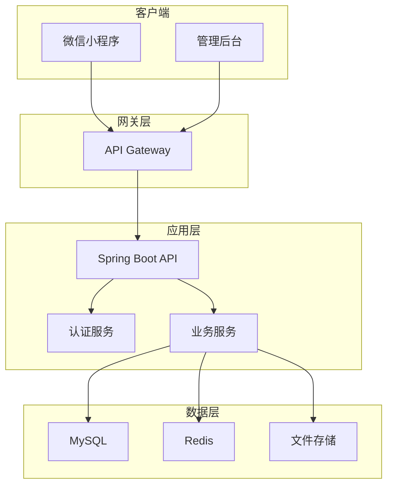
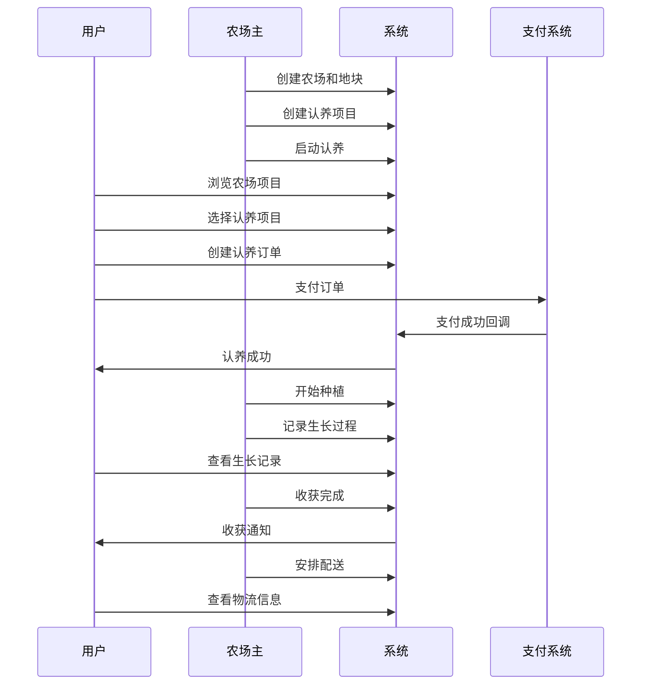
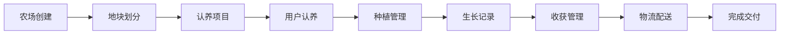
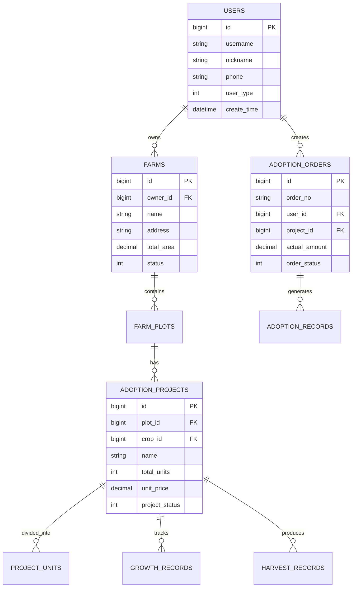

# iFarm 电子农场认养系统 API 文档

## 🌱 项目概述

iFarm 是一个基于微信小程序的电子农场认养系统，用户可以认养农场中的种植单元，实时查看作物生长过程，收获后享受新鲜农产品配送到家的服务。系统采用前后端分离架构，为用户端和管理端提供完整的API服务。

## 🚀 技术栈

### 后端技术
- **框架**: Spring Boot 3.1.5
- **数据库**: MySQL 8.0.33
- **ORM**: MyBatis Plus 3.5.5
- **认证**: JWT Token
- **文档**: Swagger 3 + Knife4j
- **缓存**: Redis 6.0+
- **消息队列**: RabbitMQ 3.8+

### 前端技术
- **微信小程序**: 原生开发
- **管理后台**: Vue 3 + Element Plus
- **移动端**: 响应式设计

## 📋 核心功能

### 用户端功能
- 🔐 微信登录注册
- 🏡 农场浏览与搜索
- 🌾 作物信息查看
- 💰 认养项目下单
- 📱 支付功能集成
- 📈 生长过程跟踪
- 🚚 物流配送跟踪
- 👤 个人信息管理

### 管理端功能
- 🏢 农场信息管理
- 🌱 作物品种管理
- 📊 认养项目管理
- 📝 生长记录管理
- 💼 订单管理
- 📈 数据统计分析
- 👥 用户管理
- ⚙️ 系统配置

## 🏗️ 系统架构



## 📚 API 文档结构

### 微信小程序用户端 API
**文档路径**: [./mini/](./mini/)

| 模块 | 说明 | 文档链接 | 实现状态 |
|------|------|----------|----------|
| 认证模块 | 用户登录、注册、Token管理 | [auth.md](./mini/auth.md) | ✅ 完全实现 |
| 农场浏览 | 农场信息、地块查看 | [farm.md](./mini/farm.md) | ✅ 完全实现 |
| 作物分类 | 作物信息、分类浏览 | [crop.md](./mini/crop.md) | ✅ 完全实现 |
| 认养模块 | 项目认养、订单管理 | [adoption.md](./mini/adoption.md) | ⚠️ 部分实现 |
| 生长记录 | 生长过程、收获记录 | [growth.md](./mini/growth.md) | 🚧 待实现 |

### 后台管理系统 API
**文档路径**: [./admin/](./admin/)

| 模块 | 说明 | 文档链接 | 实现状态 |
|------|------|----------|----------|
| 农场管理 | 农场、地块管理 | [farm-management.md](./admin/farm-management.md) | ✅ 完全实现 |
| 作物管理 | 作物、分类管理 | [crop-management.md](./admin/crop-management.md) | ⚠️ 部分实现 |
| 项目管理 | 认养项目管理 | [project-management.md](./admin/project-management.md) | ⚠️ 部分实现 |
| 订单管理 | 订单处理、统计 | [order-management.md](./admin/order-management.md) | 🚧 待实现 |
| 记录管理 | 生长、收获记录 | [growth-management.md](./admin/growth-management.md) | 🚧 待实现 |

## 🔄 业务流程

### 核心认养流程



### 数据流转图



## 🌐 环境配置

### 开发环境
- **API Base URL**: `http://localhost:8081/api`
- **Swagger UI**: `http://localhost:8081/swagger-ui.html`
- **Knife4j UI**: `http://localhost:8081/doc.html`

### 生产环境
- **API Base URL**: `https://api.ifarm.com`
- **管理后台**: `https://admin.ifarm.com`
- **用户端**: 微信小程序

## 🔐 认证机制

### JWT Token 认证
- **Access Token**: 有效期2小时，用于API访问
- **Refresh Token**: 有效期7天，用于刷新Access Token
- **Token 格式**: `Bearer {token}`

### 权限控制
- **普通用户**: 只能访问用户端API
- **农场主**: 可访问管理端API，管理自己的数据
- **管理员**: 可访问所有管理端API

## 📊 数据模型

### 核心实体关系



## 🔧 开发指南

### 本地开发环境搭建

1. **克隆项目**
```bash
git clone https://github.com/ifarm/ifarm-backend-springboot.git
cd ifarm-backend-springboot
```

2. **配置数据库**
```bash
# 创建数据库
mysql -u root -p < database/ifarm_schema.sql
```

3. **配置应用**
```yaml
# application-dev.yml
spring:
  datasource:
    url: jdbc:mysql://localhost:3306/ifarm_dev
    username: your_username
    password: your_password
```

4. **启动应用**
```bash
mvn spring-boot:run
```

### API 测试

1. **Swagger UI**: 访问 `http://localhost:8081/swagger-ui.html`
2. **Knife4j**: 访问 `http://localhost:8081/doc.html`
3. **Postman**: 导入API文档进行测试

### 代码生成

项目使用MyBatis Plus代码生成器：

```java
// 运行测试类生成代码
@Test
public void generateAllBusinessTables() {
    // 生成Controller、Service、Mapper等
}
```

## 📈 监控与运维

### 健康检查
- **应用状态**: `/actuator/health`
- **系统信息**: `/actuator/info`
- **性能指标**: `/actuator/metrics`

### 日志管理
- **应用日志**: 使用Logback记录
- **访问日志**: Nginx访问日志
- **错误监控**: 集成错误监控系统

### 性能优化
- **数据库**: 索引优化、查询优化
- **缓存**: Redis缓存热点数据
- **CDN**: 静态资源CDN加速

## 🚀 部署指南

### Docker 部署

```dockerfile
FROM openjdk:17-jdk-slim
COPY target/ifarm-backend.jar app.jar
EXPOSE 8081
ENTRYPOINT ["java", "-jar", "/app.jar"]
```

### Kubernetes 部署

```yaml
apiVersion: apps/v1
kind: Deployment
metadata:
  name: ifarm-backend
spec:
  replicas: 3
  selector:
    matchLabels:
      app: ifarm-backend
  template:
    metadata:
      labels:
        app: ifarm-backend
    spec:
      containers:
      - name: ifarm-backend
        image: ifarm/backend:latest
        ports:
        - containerPort: 8081
```

## 📞 联系方式

### 开发团队
- **技术负责人**: tech-lead@ifarm.com
- **后端开发**: backend@ifarm.com
- **前端开发**: frontend@ifarm.com

### 技术支持
- **API支持**: api-support@ifarm.com
- **文档反馈**: docs@ifarm.com
- **Bug报告**: bugs@ifarm.com

### 商务合作
- **商务咨询**: business@ifarm.com
- **合作伙伴**: partners@ifarm.com

## 📄 许可证

本项目采用 MIT 许可证，详情请查看 [LICENSE](../LICENSE) 文件。

## 🔄 版本历史

- **v1.0.0** (2025-01-19): 初始版本发布
  - 完成核心认养功能
  - 用户端和管理端API
  - 基础数据统计功能

## 🤝 贡献指南

欢迎贡献代码和文档！请查看 [CONTRIBUTING.md](../CONTRIBUTING.md) 了解详细信息。

---

**最后更新**: 2025-01-19  
**文档版本**: v1.0.0
