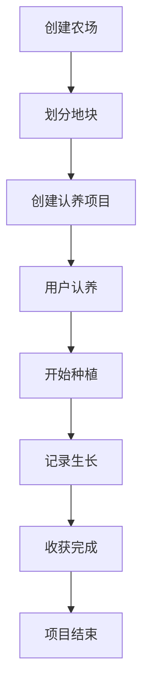
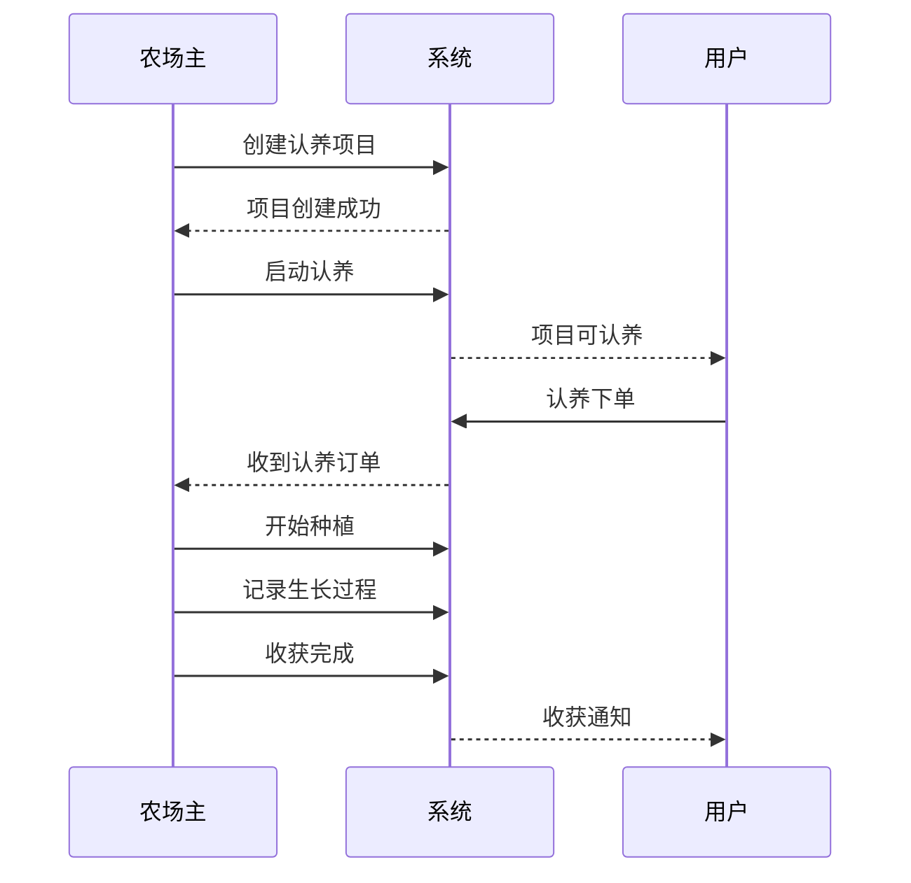

# iFarm 后台管理系统 API 文档

## 概述

iFarm 后台管理系统API为管理员和农场主提供完整的农场管理功能，包括农场管理、作物管理、认养项目管理、订单管理、数据统计等核心业务功能。

## 技术规范

- **协议**: HTTPS
- **数据格式**: JSON
- **字符编码**: UTF-8
- **认证方式**: JWT Bearer Token
- **基础URL**: `https://admin.ifarm.com` (生产环境) / `http://localhost:8081/api` (开发环境)

## 用户角色与权限

### 角色定义

| 角色 | 说明 | 权限范围 |
|------|------|----------|
| 管理员 (ADMIN) | 系统管理员 | 全部功能，可管理所有数据 |
| 农场主 (FARM_OWNER) | 农场所有者 | 管理自己的农场、项目、订单 |
| 普通用户 (USER) | 认养用户 | 无后台管理权限 |

### 权限控制

- **@PreAuthorize("hasRole('ADMIN')")**: 仅管理员可访问
- **@PreAuthorize("hasRole('FARM_OWNER')")**: 仅农场主可访问
- **@PreAuthorize("hasRole('ADMIN') or hasRole('FARM_OWNER')")**: 管理员或农场主可访问
- **数据权限**: 农场主只能操作自己的数据，管理员可操作所有数据

## 认证机制

### Token获取
管理员和农场主通过用户名密码登录获取访问Token：

```http
POST /auth/login
```

### Token使用
所有管理接口都需要在请求头中携带Token：

```http
Authorization: Bearer {accessToken}
```

### 权限验证
系统会根据用户角色和数据归属进行权限验证。

## API模块列表

### 1. [农场管理模块](./farm-management.md)
- 农场信息管理
- 地块管理
- 农场状态控制

**基础路径**: `/api/farms`, `/api/farm-plots`

**主要功能**:
- 创建、编辑、删除农场
- 地块划分和管理
- 农场状态监控

### 2. [作物与分类管理模块](./crop-management.md)
- 作物品种管理
- 分类体系管理
- 数据导入导出

**基础路径**: `/api/categories`, `/api/crops`

**主要功能**:
- 作物分类管理
- 作物品种信息维护
- 批量数据操作

### 3. [认养项目管理模块](./project-management.md)
- 认养项目创建和管理 ✅
- 项目单元管理 ⚠️
- 项目状态控制 🚧

**基础路径**: `/adoption-projects`

**主要功能**:
- 创建认养项目
- 管理项目单元
- 项目进度跟踪

### 4. [订单管理模块](./order-management.md)
- 认养订单管理 🚧
- 订单统计分析 🚧
- 退款处理 🚧

**基础路径**: `/api/adoption-orders`

**主要功能**:
- 订单查看和管理
- 订单状态控制
- 数据统计分析

### 5. [生长记录管理模块](./growth-management.md)
- 生长记录管理 🚧
- 收获记录管理 🚧
- 媒体文件管理 🚧

**基础路径**: `/api/growth-records`, `/api/harvest-records`

**主要功能**:
- 记录作物生长过程
- 管理收获信息
- 图片视频管理

## 核心业务流程

### 农场管理流程



### 项目管理流程



## 数据统计与分析

### 统计维度

1. **农场维度**
   - 农场数量、面积统计
   - 地块利用率
   - 项目分布情况

2. **项目维度**
   - 项目认养率
   - 收入统计
   - 用户参与度

3. **订单维度**
   - 订单量趋势
   - 收入趋势
   - 用户消费分析

4. **时间维度**
   - 日、周、月、年统计
   - 同比、环比分析
   - 趋势预测

### 报表功能

- **实时数据看板**: 关键指标实时展示
- **趋势分析报表**: 各维度趋势分析
- **对比分析报表**: 不同时期、不同农场对比
- **用户行为分析**: 用户认养行为分析

## 通用功能

### 分页查询

所有列表接口都支持分页：

```json
{
  "current": 1,      // 当前页码
  "size": 10,        // 每页大小
  "total": 100,      // 总记录数
  "pages": 10,       // 总页数
  "records": []      // 数据列表
}
```

### 批量操作

支持批量操作的接口：

```json
{
  "action": "delete",        // 操作类型
  "ids": [1, 2, 3],         // 目标ID列表
  "params": {}              // 操作参数
}
```

### 数据导出

支持Excel格式数据导出：

- 订单数据导出
- 统计报表导出
- 用户数据导出
- 项目数据导出

### 文件上传

支持图片和文档上传：

- 农场图片上传
- 作物图片上传
- 生长记录图片上传
- 数据批量导入

## 状态管理

### 农场状态

| 状态 | 说明 | 操作权限 |
|------|------|----------|
| 正常 | 正常运营 | 农场主/管理员 |
| 禁用 | 暂停服务 | 仅管理员 |
| 审核中 | 等待审核 | 仅管理员 |

### 项目状态

| 状态 | 说明 | 流转条件 |
|------|------|----------|
| 筹备中 | 项目准备阶段 | 可启动认养 |
| 认养中 | 开放认养 | 可开始种植 |
| 种植中 | 正在种植 | 可开始收获 |
| 收获中 | 正在收获 | 可完成项目 |
| 已完成 | 项目结束 | 终态 |
| 已取消 | 项目取消 | 终态 |

### 订单状态

| 状态 | 说明 | 可操作 |
|------|------|--------|
| 待支付 | 等待支付 | 取消、支付 |
| 已支付 | 支付完成 | 退款、完成 |
| 已完成 | 订单完成 | 无 |
| 已取消 | 订单取消 | 无 |
| 已退款 | 已退款 | 无 |

## 安全机制

### 数据安全

1. **数据隔离**: 农场主只能访问自己的数据
2. **操作日志**: 记录所有关键操作
3. **数据备份**: 定期数据备份
4. **敏感信息**: 用户手机号等敏感信息脱敏显示

### 接口安全

1. **身份认证**: JWT Token认证
2. **权限控制**: 基于角色的权限控制
3. **请求限流**: 防止恶意请求
4. **参数验证**: 严格的参数验证

### 业务安全

1. **状态控制**: 严格的状态流转控制
2. **数据一致性**: 事务保证数据一致性
3. **业务规则**: 完善的业务规则验证
4. **异常处理**: 完善的异常处理机制

## 监控与告警

### 系统监控

- **接口性能**: 响应时间、成功率监控
- **系统资源**: CPU、内存、磁盘监控
- **数据库**: 连接数、慢查询监控
- **业务指标**: 关键业务指标监控

### 告警机制

- **系统异常**: 系统错误自动告警
- **业务异常**: 业务异常自动告警
- **性能告警**: 性能指标超阈值告警
- **安全告警**: 安全事件自动告警

## 版本信息

- **当前版本**: v1.0.0
- **最后更新**: 2025-01-19
- **兼容性**: 支持现代浏览器，推荐Chrome 80+

## 开发指南

### 环境要求

- **Java**: JDK 17+
- **数据库**: MySQL 8.0+
- **缓存**: Redis 6.0+
- **消息队列**: RabbitMQ 3.8+

### 本地开发

1. 克隆代码仓库
2. 配置数据库连接
3. 启动Redis和RabbitMQ
4. 运行Spring Boot应用
5. 访问管理后台

### API测试

- **Swagger UI**: `/swagger-ui.html`
- **Knife4j**: `/doc.html`
- **Postman**: 导入API文档

## 联系方式

如有问题，请联系开发团队：
- 技术支持：tech@ifarm.com
- 产品咨询：product@ifarm.com
- 商务合作：business@ifarm.com
