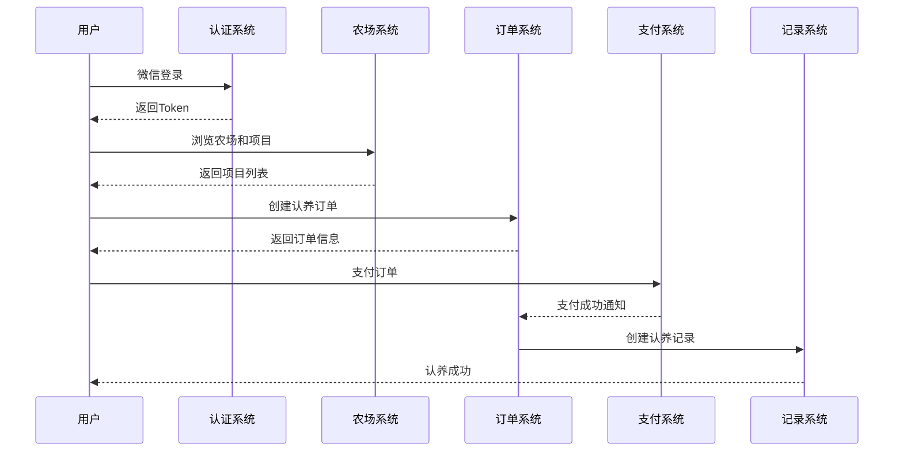
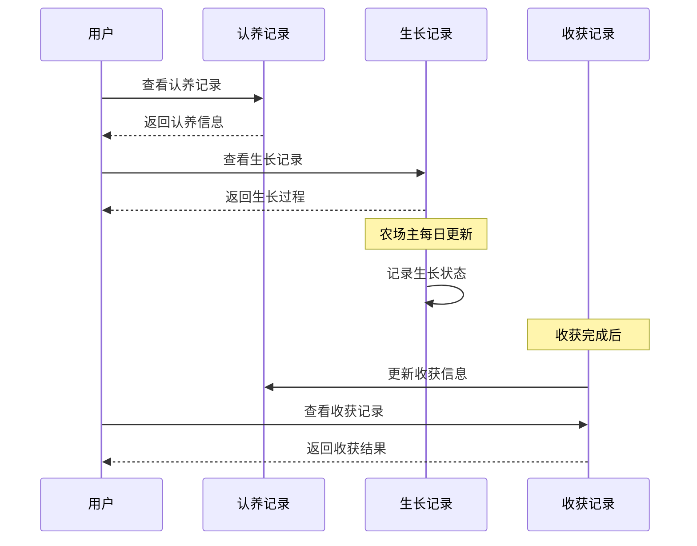

# iFarm 微信小程序用户端 API 文档

## 概述

iFarm 微信小程序用户端API为普通用户提供农场认养服务，用户可以浏览农场、认养作物、查看生长过程、收获农产品等完整的农场认养体验。

## 技术规范

- **协议**: HTTPS
- **数据格式**: JSON
- **字符编码**: UTF-8
- **认证方式**: JWT Bearer Token
- **基础URL**: `https://api.ifarm.com` (生产环境) / `http://localhost:8081/api` (开发环境)

## 通用响应格式

所有API接口都遵循统一的响应格式：

```json
{
  "code": 200,           // 状态码：200-成功，其他-失败
  "message": "操作成功",  // 响应消息
  "data": {},           // 响应数据，可能为对象、数组或null
  "timestamp": "2025-01-19T16:00:00"  // 响应时间戳
}
```

## 认证机制

### Token获取
用户通过微信登录或用户名密码登录获取访问Token：

```http
POST /auth/wechat-login
POST /auth/login
```

### Token使用
需要认证的接口在请求头中携带Token：

```http
Authorization: Bearer {accessToken}
```

### Token刷新
Token过期前可使用refreshToken刷新：

```http
POST /auth/refresh
```

## API模块列表

### 1. [认证模块](./auth.md)
- 微信小程序登录
- 用户名密码登录
- Token刷新
- 用户信息管理
- 密码修改

**基础路径**: `/auth`

### 2. [农场浏览模块](./farm.md)
- 农场列表查询
- 农场详情查看
- 农场搜索
- 地块信息查看

**基础路径**: `/api/farms`, `/api/farm-plots`

### 3. [作物与分类模块](./crop.md)
- 作物分类浏览
- 作物信息查看
- 分类树结构
- 作物搜索

**基础路径**: `/api/categories`, `/api/crops`

### 4. [认养模块](./adoption.md)
- 认养项目浏览 ✅
- 认养订单管理 🚧
- 认养记录查看 🚧
- 支付功能 🚧

**基础路径**: `/adoption-projects`, `/api/adoption-orders`, `/api/adoption-records`

### 5. [生长记录模块](./growth.md)
- 生长记录查看 🚧
- 收获记录查看 🚧
- 生长阶段跟踪 🚧
- 环境数据查看 🚧

**基础路径**: `/api/growth-records`, `/api/harvest-records`

## 核心业务流程

### 用户认养流程



### 生长跟踪流程



## 状态码说明

### HTTP状态码
| 状态码 | 说明 |
|--------|------|
| 200 | 请求成功 |
| 400 | 请求参数错误 |
| 401 | 未认证或Token无效 |
| 403 | 权限不足 |
| 404 | 资源不存在 |
| 409 | 业务冲突（如库存不足） |
| 500 | 服务器内部错误 |

### 业务状态码
| 状态码 | 说明 |
|--------|------|
| 200 | 操作成功 |
| 1001 | 参数验证失败 |
| 1002 | 用户不存在 |
| 1003 | 密码错误 |
| 1004 | Token无效 |
| 2001 | 农场不存在 |
| 2002 | 项目不可认养 |
| 2003 | 库存不足 |
| 3001 | 订单不存在 |
| 3002 | 订单状态错误 |
| 3003 | 支付失败 |

## 分页参数

所有列表查询接口都支持分页，使用统一的分页参数：

| 参数名 | 类型 | 必填 | 默认值 | 说明 |
|--------|------|------|--------|------|
| current | Integer | 否 | 1 | 当前页码 |
| size | Integer | 否 | 10 | 每页大小 |

分页响应格式：

```json
{
  "records": [],        // 数据列表
  "total": 100,         // 总记录数
  "size": 10,           // 每页大小
  "current": 1,         // 当前页码
  "pages": 10           // 总页数
}
```

## 时间格式

所有时间字段都使用ISO 8601格式：

- 日期时间：`2025-01-19T16:00:00`
- 日期：`2025-01-19`
- 时间：`16:00:00`

## 图片资源

所有图片字段返回完整的URL地址，支持HTTPS访问。图片格式支持：

- JPG/JPEG
- PNG
- WebP

## 错误处理

### 客户端错误处理建议

1. **网络错误**：显示网络连接失败提示，提供重试功能
2. **认证错误**：自动跳转到登录页面
3. **业务错误**：根据错误码显示相应的用户友好提示
4. **服务器错误**：显示系统繁忙提示

### 错误响应示例

```json
{
  "code": 1001,
  "message": "参数验证失败：项目ID不能为空",
  "data": null,
  "timestamp": "2025-01-19T16:00:00"
}
```

## 安全注意事项

1. **HTTPS传输**：生产环境必须使用HTTPS
2. **Token安全**：Token应安全存储，避免泄露
3. **参数验证**：客户端应进行基础参数验证
4. **敏感信息**：不在URL中传递敏感信息
5. **请求频率**：避免频繁请求，实现合理的缓存机制

## 版本信息

- **当前版本**: v1.0.0
- **最后更新**: 2025-01-19
- **兼容性**: 支持微信小程序基础库 2.0.0+

## 联系方式

如有问题，请联系开发团队：
- 邮箱：api@ifarm.com
- 技术支持：support@ifarm.com
